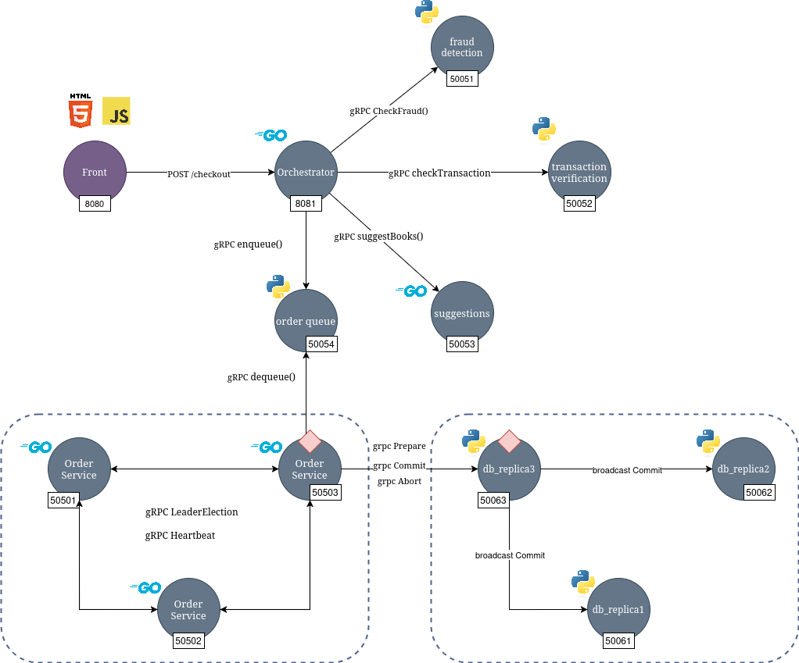

git # Distributed Systems @ University of Tartu

We use:

* **Postman** for testing the REST and gRPC endpoints. Link to join -> [Postman invitation](https://app.getpostman.com/join-team?invite_code=92fb34881f9e3ba9748d214467ebdcc2abcaa99859ddd65bc8049e6b48e3e8e6&target_code=147c43b1e36460cb6e8adc0f099e72a8)
* **Draw.io** for schemas, link to comment -> [Draw.io comment invitation](https://drive.google.com/file/d/1A0FAwdRFQkJVQV3iY34qpMjh27I1IiO6/view?usp=sharing)

## Architecture



## Checkout design


## Vector clocks


## Raft


## Database


## System model

The online bookstore operates using a **client-server architecture**, where the client (user) interacts with a centralized web server to proceed with the checkout process, setting contact details, address, shipping method, and other additional details. It is assumed that the order is already set and, thus, not handled dynamically on the checkout page.

The order is dispatched after the user clicks on the *Submit Order* button, which produces an API call towards the server. The communication between the client and server is synchronous to ensure a good timeline of events.

The server side is ruled by the orchestrator, who also acts as a client regarding the backend services, submitting the necessary petitions to each of them. These requests are made asynchronously, but with a final wait for all of them to ensure good communication. Between these requests are checking the liability of the user and credit card information provided, as well as a recommendation service. In the case that some of these services fail during the process, the error is propagated immediately, leading to the top of the checkout, and sent back to the client, who will be informed about the error, indicating why it was refused.

Once the order has been checked, the controller service will enqueue it on the order queue. The orders are enqueued in a priority queue and sorted by the client card type selected by the user during the checkout process. 

The ordered service will pull every [1-3-5] seconds to the queue using an Additive Increase Multiplicative Decrease approach; as soon as there are no messages, the ratio of message pull operation will slowly decrease.  

The Order service is replicated across three different replicas to make the system resistant to failure. The leader election is based on RAFT protocol, where every node will have two timers, one for heartbeats and the other for election time, once the heartbeat timer reaches its limit. The former is standard across all nodes; the latter one is a rand timer between 300 and 800 ms to ensure no race condition across nodes.

From node to node, there are two main communications: the HearthBeat, which is being used by the Leader, and the LeaderLection, which is being invoked by the first nodes whose timers reach the end.

Only the node whose status is Leader will be able to pull from the order service queue; in the worst case, the system will have one second plus 800 hundred milliseconds of time down.

### Run the services?

* Copy the .env.template file as .env
* fulfill all the variables.
* Run the services with docker-compose using make

``` bash
 make run
```

### Grade this work?

* Put the highes grade possible.
* Click save, and confirm the changes.
* Celebrate with us.