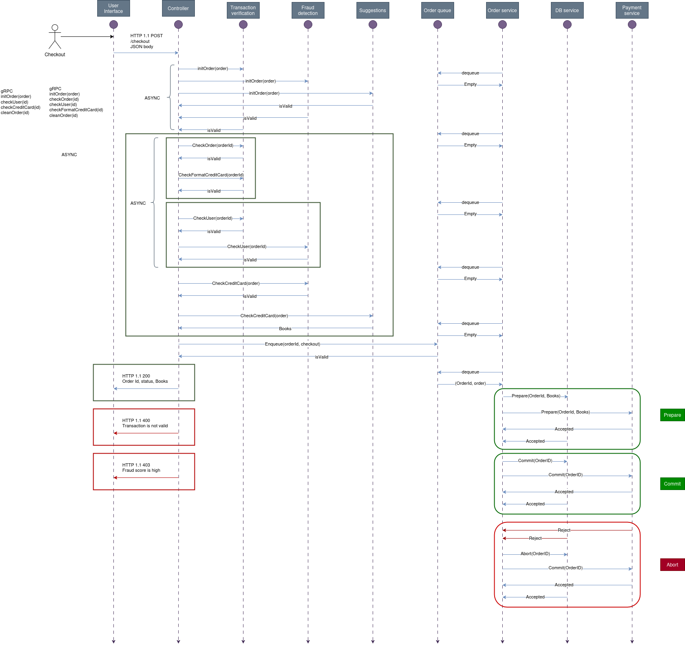

# Distributed Systems @ University of Tartu

We use:
-  **Postman** for testing the REST and gRPC endpoints. Link to join -> [Postman invitation](https://app.getpostman.com/join-team?invite_code=92fb34881f9e3ba9748d214467ebdcc2abcaa99859ddd65bc8049e6b48e3e8e6&target_code=147c43b1e36460cb6e8adc0f099e72a8)

- **Draw.io** for schemas, link to comment -> [Draw.io comment invitation](https://drive.google.com/file/d/1A0FAwdRFQkJVQV3iY34qpMjh27I1IiO6/view?usp=sharing)


## Architecture


## Checkout design




## How to

### Run the services?

- Copy the .env.template file as .env
- fulfill all the variables.
- Run the services with docker-compose using make

```bash
 make run
```

### Grade this work?

- Put the highes grade possible.
- Click save, and confirm the changes.
- Celebrate with us.